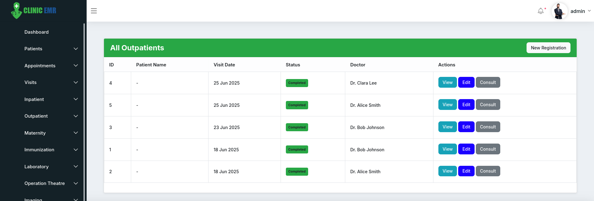

# 🏥 ClinicEMR

**ClinicEMR** is a modular Electronic Medical Record (EMR) system built for clinics, outpatient centers, and small hospitals. It integrates core healthcare workflows such as patient management, billing, pharmacy, HR, inventory, and more — with a focus on usability and real-time insights.

---

## 📸 Screenshots

| Dashboard | OPD Queue | Patient Profile |
|-----------|-----------|-----------------|
|  |  |  |

---

## ⚙️ Key Features

### 👨‍⚕️ Patient & Visit Management
- Registration, visit initiation (OPD/IP/Emergency)
- Capture vitals, queueing, consultation workflows
- Linked billing and records per visit

### 🧾 Billing & Invoicing
- Auto invoice generation for services, labs, imaging, and medications
- PDF receipts, invoice editing, itemized views
- Insurance-ready and split-payment support

### 💊 Pharmacy Integration
- Dispense medications linked to visit/prescription
- Stock deductions & expiry management
- Direct and walk-in sales support

### 🧪 Laboratory & Radiology
- Order tests from consultations
- Record results, attach documents, and share reports
- Integrated with billing

### 🧍‍♂️ HR & Payroll
- Employee records, leave tracking, and shift rosters
- Payroll calculation, payslip generation, and deductions

### 🏪 Inventory & Procurement
- Item management, store transfers
- Purchase Orders (PO), GRNs, stock adjustments, and alerts

### 🔐 Role-Based Access Control (RBAC)
- Fine-grained access via Roles & Permissions
- Admin UI for user and permission management

---

## 🧰 Tech Stack

| Layer     | Tech                              |
|-----------|-----------------------------------|
| Backend   | Laravel 10 / CodeIgniter 4        |
| Frontend  | Blade, Bootstrap 5, jQuery        |
| Database  | MySQL / MariaDB                   |
| Auth      | Laravel Breeze / Custom RBAC      |
| Reports   | DomPDF, SnappyPDF (PDF generation)|
| Queue     | Laravel Queues / Cron Jobs        |

---

## 🧑‍💻 Installation Guide

```bash
# Clone the repo
git clone git@github.com:HumphreyLidwaji/ClinicEMR.git
cd ClinicEMR

# Install dependencies
composer install

# Copy and configure .env
cp .env.example .env
php artisan key:generate

# Configure database in .env
php artisan migrate --seed

# Serve the app
php artisan serve

